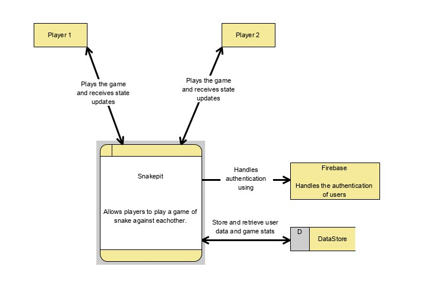
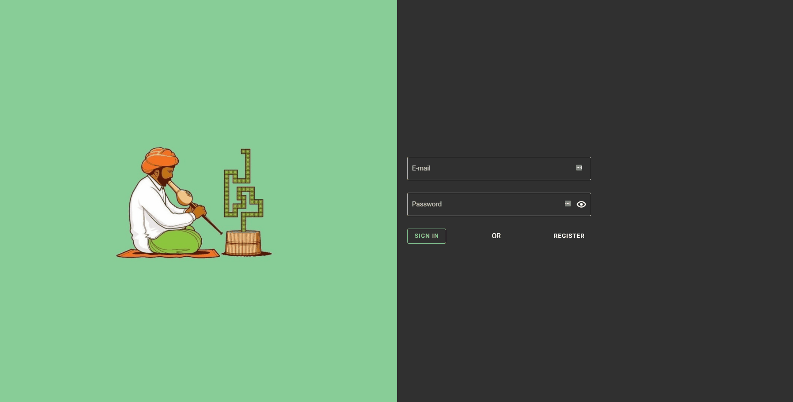
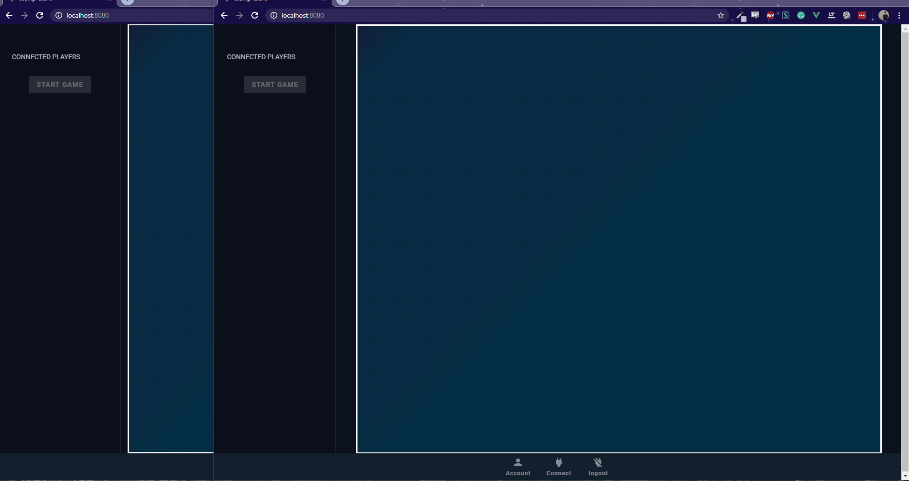

# Vuesnake!

A websocket based multiplayer snake game made with Vue.js

## What is Vuesnake?

Vuesnake is a Vue.js based multiplayer snake game, using websockets as the communication. Vuesnake is connected to a small gameserver [written in java](https://github.com/RoyAppeldoorn/snake-server). The client is also connected to a [spring boot rest api](https://github.com/RoyAppeldoorn/snake-api). This was my first interaction with websockets and it is developed for local use only. I know that beats the purpose of using websockets but it was a great exercise.

### Features
* Registration via firebase. 
* Login authentication.
* Unique snake names.
* Unique snake color for each player. 
* Live kill count / dead count update for your character. 
* Snake can travel through walls. 
* Game keeps count of the points. 



## Registration



## Gameplay



## Project setup
```
npm install
```

### Compiles and hot-reloads for development
```
npm run serve
```

### Compiles and minifies for production
```
npm run build
```

### Lints and fixes files
```
npm run lint
```
